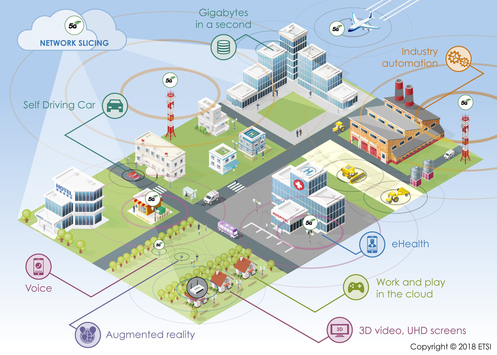

# 5G

- Classificação: Tecnologia
- Concepção: 2013
- Lançamento: 2019

Descrição: 5G é a quinta geração da tecnologia para comunicação de redes móveis de celulares. A grande vantagem da nova geração sobre a tecnologia de 4G é a sua velocidade muito superior, eventualmente podendo atingir impressionantes 10Gbit/s.

## Características

### Tecnologia

- Alcance: Redes 5G operam em frequências mais altas do que as redes 4G, com isso seu alcance é reduzido, em cerca de 10 metros.
- Velocidade: As velocidades de redes 5G variam de ~50 Mbit/s até alguns Gbit/s.

### Exemplo de uso

## Referências

- [Wikipedia](https://en.wikipedia.org/wiki/5G)

- [Digitaltrends](https://www.digitaltrends.com/mobile/what-is-5g/#Specifics)

- [ITU](http://www.itu.int/net/pressoffice/press_releases/2015/27.aspx)

- [Techmanza](https://web.archive.org/web/20170518165251/https://www.techmanza.in/5g-mobile-network-technology.html)