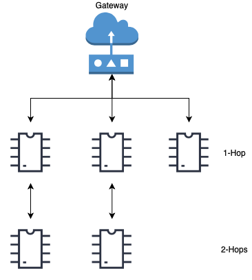

# 802.11s

- Classificação: protocolo de comunicação da camada de enlace
- Concepção: 2003
- Lançamento: 2012

Descrição: permite que dispositivos se comuniquem através de redes sem-fio sem a necessidade de haver um roteador.

## Características

### Tecnologia

- **Alcance**: como o 802.11s depende do 802.11a, 802.11b, 802.11g, 802.11n, 802.11ac ou 802.11ax para se comunicar, o seu alcance será determinado pelo alcance desses protocolos. Algo entre 35 (802.11b) e 250m (802.11n).
- **Velocidade**: o mesmo se aplica à velocidade. Algo entre 1 (802.11b) e 1147 Mbit/s (802.11ax).
- **Protocolos**: o protocolo de roteamento padrão que funciona no 802.11s é o [Hybrid Wireless Mesh Protocol](https://en.wikipedia.org/wiki/Hybrid_Wireless_Mesh_Protocol), mas também pode funcionar com OLSR, OSPF ou B.A.T.M.A.N..

### Protocolo

- IEEE 802.11
- Tecnologias que usam: Google Wifi, Arduino Yún

### Exemplo de uso

## Referências

[Multihop MAC: Desvendando o Padrão 802.11s](http://www2.ic.uff.br/~celio/papers/minicurso-sbrc08.pdf)

[802.11s-2011 - IEEE Standard for Information Technology](https://standards.ieee.org/standard/802_11s-2011.html)

