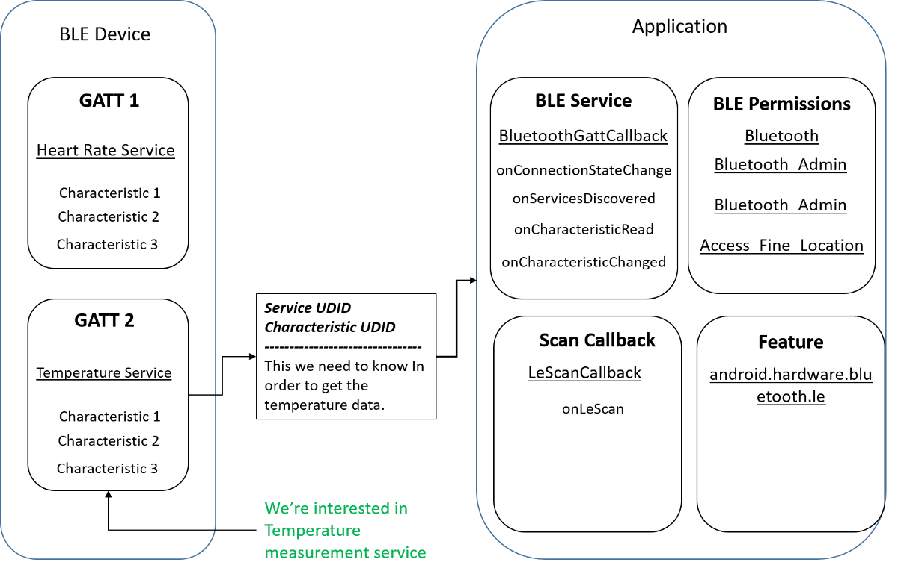

# Bluetooth Low Energy (BLE)

- Classificação: Tecnologia
- Concepção: 2006 (com o nome Wibree)
- Lançamento: 2009 (incorporado ao Bluetooth 4.0)

Descrição: Permite uma comunicação sem fio entre dispositivos compatíveis. Ideal para quando deseja-se diminuir o gasto de energia e custo do dispositivo, mantendo o mesmo alcance do Bluetooth clássico.

## Características

Bluetooth Low Energy é uma tecnologia à parte do Bluetooth padrão, mas utiliza a mesma frequência, o que permite que dispositivos implementem ambos com facilidade.

### Tecnologia

- Alcance: até 100 m
- Velocidade: 125 kbit/s à 2 Mbits/s
- Protocolos:
    - GATT (Generic Attribute Profile)
    - GAP (General Access Profile)

### Protocolo

Há diversos perfis definidos para padronizar determinados tipos de uso nos dispositivos, definidos em categorias que vão desde conexão à internet até perfis de saúde. Alguns exemplos de perfis são:

- BLP (Blood Pressure Profile): para medição da pressão sanguínea
- MESH (Mesh Profile): para definição de uma rede mesh 
- CSCP (Cycling Speed and Cadence Profile): para uso em sensores acoplados a uma bicicleta
- IPSP (Internet Protocol Support Profile): comunicação com a internet
- HOGP (HID over GATT Profile): para o uso de periféricos (como mouse, teclado, etc...)
- FMP ("Find me" Profile): permite um dispositivo acionar um alerta em um segundo dispositivo que foi perdido

Em janeiro de 2020, foi anunciado também um perfil de audio, que suportará conexão a diversas fontes de audio, fornecendo maior duração de bateria em relação ao Bluetooth clássico.

### Exemplo de uso

#### Esquema de comunicação de um dispositivo BLE com um aplicativo para Android

## Referências

[Wikipédia](https://en.wikipedia.org/wiki/Bluetooth_Low_Energy)

[Especificação](https://web.archive.org/web/20170310111443/https://www.bluetooth.com/what-is-bluetooth-technology/how-it-works/low-energy)