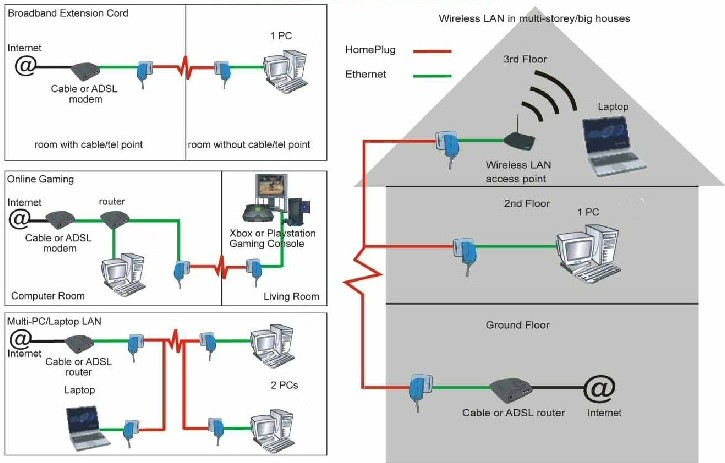

# Broadband over Power Lines (BPL)

- Classificação: Tecnologia
- Concepção: 2004 
- Lançamento: 2010 (IEEE 1901)

Descrição: Um dos padrões de comunicação *Power-line*, o BPL realiza a comunicação de alta-velocidade entre dispositivos através de linhas de energia permitindo a fácil instalação de redes lógicas onde há apenas a presença da instalação elétrica.

## Características

### Tecnologia

- Alcance: até 100 m (entre dispositivos) e até 1500 m (instalações)
- Frequência: 1.705 MHz a 100 MHz
- Velocidade: até 500 Mbits/s
- Protocolos:
    - *Inter-system protocol* (ISP);
    - *Coexistence protocol* (CXP).

### Protocolo

Especificado pelo padrão IEEE 1901 e ampliado pelo IEEE 1901.1 (frequência média) e IEEE 1901.2 (frequência baixa).

- IEEE 1901:
  - define 2 opções de camadas físicas (PHY): uma baseada em uma modulação FFT (*Fast Fourier transform*) OFDM (*Orthogonal frequency-division multiplexing*) e outra baseada em uma modulação de *wavelet* OFDM;
  - pode ser modulado até 1024-QAM;
  - o "FFT PHY" inclui o esquema de correção de erro: FEC (*forward error correction*) baseado no CTC (*convolutional turbo code*);
  - o "Wavelet PHY" inclui o esquema de correção de erro FEC concatenado ao RS (*Reed–Solomon error correction) e CTC, podendo ainda usar a verificação de paridade LDPC (*Low-Density Parity-Check*);
  - em cima das camadas físicas, 2 camadas de controle de acesso ao meio (MAC) são propostas: uma para rede local e outra para interconexão com a internet;
  - para se gerenciar as camadas PHYs e MACs se utiliza o protocolo ISP.

- IEEE 1901.1:
  - utiliza frequências até 12 MHz;
  - realiza qualquer tipo de multiplexação OFDM;
  - implementa acesso ao meio do tipo TDMA (*Time-division multiple access*) ou CSMA/CA (*Carrier-sense multiple access with collision avoidance*);
  - pode ser modulado até 16-QAM.

- IEEE 1901.2:
  - utiliza frequências até 500 kHz;
  - realiza apenas multiplexação OFDM do usando FFT;
  - suporta velocidades de transmissão de dados de até 500 kbps;
  - implementa acesso ao meio do tipo CSMA/CA ou um tipo semelhante ao FDMA (*Frequency-division multiple access*);
  - pode ser modulado até 16-QAM;
  - suporta redes elétricas de até 72 kV.

### Exemplo de uso

#### Topologias de Rede

#### Diagramas com dispositivos Power-line

## Referências

[Wikipédia IEEE 1901](https://en.wikipedia.org/wiki/IEEE_1901)

[Wikipédia BPL](https://en.wikipedia.org/wiki/Broadband_over_power_lines)

[IEEE 1901](https://standards.ieee.org/standard/1901-2010.html)
