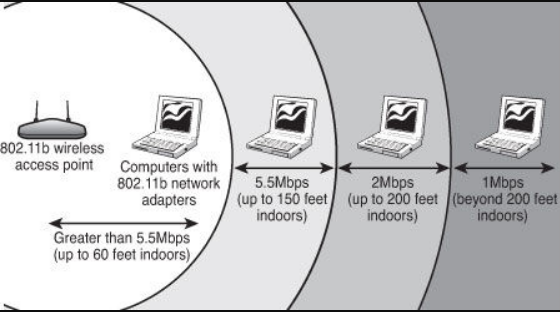
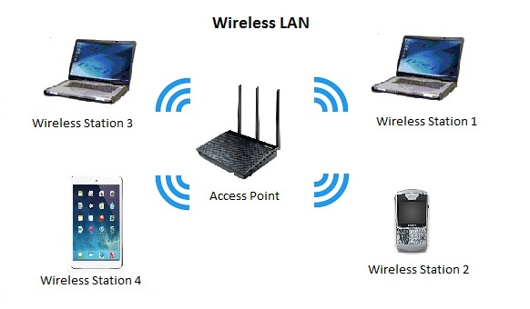

# IEEE 802.11b

- Classificação: Protocolo
- Concepção: n/a
- Lançamento: 1999

Descrição: O padrão IEEE 802.11b é uma atualziação do padrão 802.11 e define especificações de camada física, para transmissão e comunicação de dispositivos de rede local sem fio (WLAN), popularmente denominado Wi-Fi. Pode ser utilziado para comunicação sem fio de praticamente qualquer dispositivo eletrônico compatível.

## Características

### Tecnologia

- Alcance: Entre 30m (ambiente interno) e 120m (ambiente externo).
- Frequência: 2.4GHz
- Velocidade: máxima de 11Mbits/s
- Protocolos: 

### Protocolo

- IEEE 802.11b
- Wireless, WLAN

### Exemplo de uso

## Referências

[IEEE 802.11b-1999 - WikiPedia](https://en.wikipedia.org/wiki/IEEE_802.11b-1999)

[IEEE Std 802.11b-1999](http://ant.comm.ccu.edu.tw/course/92_WLAN/1_Papers/IEEE%20Std%20802.11b-1999.pdf)

[To 802.11b or not to 802.11b – that is the question](https://www.imgtec.com/blog/802-11b-802-11b-question/)

[Wireless LAN - Accolade](https://www.accoladewireless.com/solutions/wireless-networking/wireless-lan-wifi-wlan/)