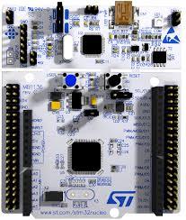
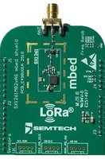
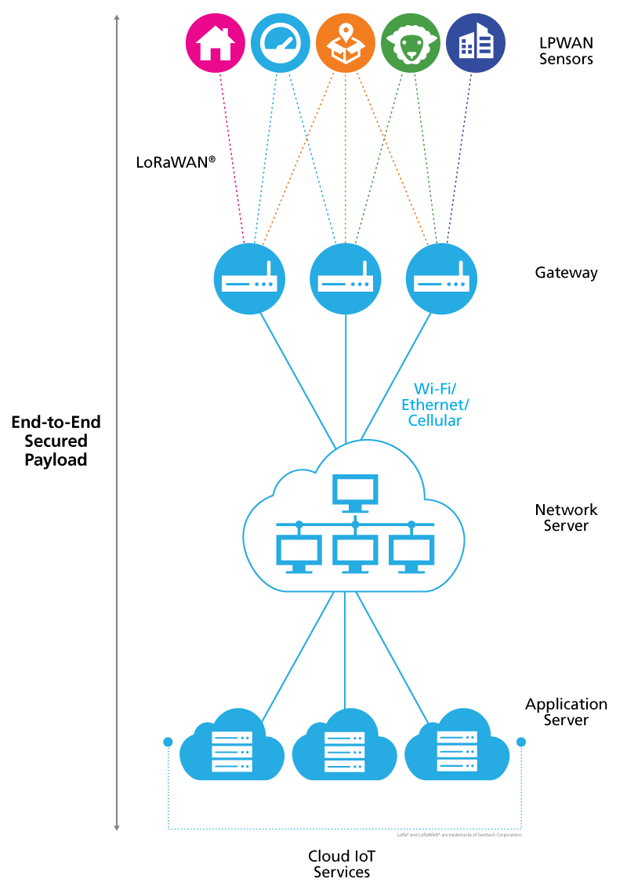

# LoRa - Long Range

- Classificação: Modulação/Tecnologia

LoRa (abreviação de Long Range) é uma tecnologia de rede sem fio e modulação de rádio de espectro de espalhamento de chirp (CSS), baseada em uma rede LPWAN (comunicações de baixa taxa de transferência de dados, baixo consumo de energia e longas distâncias). A empresa [Semtech](http://semtech.com/) é proprietária desta tecnologia. O LoRa opera sob a rede LoRaWAN, no qual é um protocolo que constitui e define o protocolo MAC para a rede. A Semtech fornece os chips de rádio LoRa, enquanto a [LoRa Alliance](https://lora-alliance.org/) (uma associação de empresas que  promove o desenvolvimento e uso de redes LoRa) cuida da padronização do protocolo LoRaWAN. 

Alguns exemplos de chips da Semtech, são os transceptores de rádio sub-GHz SX1261, SX1262, SX1268, SX1272 e dentre outros. Para desenvolvimento de LoRa, existem varios tipos de placas, um conjunto recomendado é da familia nucleo da STM32 ([NUCLEO-L073RZ](https://www.st.com/en/evaluation-tools/nucleo-l073rz.html)) com uma board desenvolvida pela Mbed com o radio SX126x ([SX126xMB2xAS](https://os.mbed.com/components/SX126xMB2xAS/)):

Nucleo-L073RZ:

Board SX126x:

## Características

### Tecnologia

O LoRa usa bandas de radiofrequência sub-gigahertz sem licença, como 433 MHz, 868 MHz (Europa), 915 MHz (Austrália e América do Norte) e 923 MHz (Ásia).

- Alcance
  - Em condições normais, de 3-4 Km de distância em zonas urbanas e 12 Km em zonas rurais. Casos fora do normal, existem recordes que passam de 800Km de distância, mas é usados dutos/balões e dispositivos utilizando antenas moxon, no qual é possivel multiplicar o alcance.

- Largura de banda
  - LoRa usa três larguras de banda: 125kHz, 250kHz e 500kHz para uplinks e downlinks.

LoRaWAN usa uma configuração diferente de frequências, fatores de espalhamento e larguras de banda, dependendo de onde você está localizado no mundo. Para as bandas EU868, EU433, CN780, AU915, LA915, AS923 e dentre outras, como citado acima. As taxas de dados para região do brasil (LA915) conforme [Everynet](https://www.everynet.com/) (empresa que implanta infraestrutura para rede LoRaWAN em algumas partes do mundo), são as seguintes:

| Index | Bandwidth | Spreading Factor | Paylaod Max Size | Physical bitrate [bit/sec] |
|:-----:|:---------:|:----------------:|:----------------:|:--------------------------:|
| 0     | 125 kHz   | SF12             | 51               | 250                        |
| 1     | 125 kHz   | SF11             | 51               | 440                        |
| 2     | 125 kHz   | SF10             | 51               | 980                        |
| 3     | 125 kHz   | SF9              | 115              | 1760                       |
| 4     | 125 kHz   | SF8              | 242              | 3125                       |
| 5     | 125 kHz   | SF7              | 242              | 5470                       |
| 6     | 500 kHz   | SF8              | 242              | 12500                      |

### Protocolo

- LoRaWAN.

### Exemplo de uso

## Referências

[Lora - Semtech](https://www.semtech.com/lora)

[Recorde de Distância](https://www.thethingsnetwork.org/article/lorawan-world-record-broken-twice-in-single-experiment-1)
