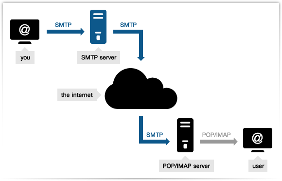

# SMTP (Simple Mail Transfer Protocol)

- Classificação: Protocolo
- Concepção: 1982 (revisado em 2008)
- Lançamento: 1982

Servidores de e-mail usam o protocolo SMTP para enviar e receber mensagens. Foi inicialmente concebido em 1982, e desde então, vários pequenos incrementos foram feitos ao protocolo, culminando em uma revisão extensiva em 2008. É utilizado até hoje.

## Características

Para enviar um e-mail, a ordem de operações definida em 1982 era:
- HELO para iniciar a sessão
- MAIL para indicar o remetente
- RCPT para indicar o(s) destinatário(s)
- DATA para passar a mensagem
- QUIT para finaliar seção

O protocolo inicialmente era bem simples, mas foi extendido ao longo dos anos. Alguns exemplos de extensões notáveis foram:

- RFC 6531 – SMTP Extension for Internationalized Email Addresses (suporte a utf-8)
- RFC 2920 – SMTP Service Extension for Command Pipelining (mandar mais de um comando em uma mensagem só)
- RFC 3030 – SMTP Service Extensions for Transmission of Large and Binary MIME Messages (envio de anexos grandes)
- RFC 3207 – SMTP Service Extension for Secure SMTP over Transport Layer Security (compatibilidade com TLS)
- RFC 4954 – SMTP Service Extension for Authentication (autenticação de usuário)

## Críticas

- Foi inicialmente definido para o envio de mensagens em formato ASCII de 7 bits. UTF-8 passou a ser aceitado após a RFC 4952.
- Formato requisição/resposta do protocolo fez com que as conexões seguissem um padrão de envio de vários pacotes pequenos, seguidas por uma transferência maior com o conteúdo da mensagem em si, o que podia causar problemas em redes com muita latência. Esse problema foi resolvido na RFC 2920.

## Exemplo de Uso

- Servidores de e-mails usam o SMTP para mandar e receber mensagens, comumente utilizando protocolo TCP na porta 25.

- Clientes de e-mail tipicamente usam SMTP apenas para mandar a mensagem para o servidor, através das portas 587 ou 465, definidas na RFC 8314. Para receber mensagens, os protocolos IMAP e POP3 são o padrão.

## Referências

- [Wikipedia](https://en.wikipedia.org/wiki/Simple_Mail_Transfer_Protocol)
- [RFC821](https://tools.ietf.org/html/rfc821)
- [RFC5321](https://tools.ietf.org/html/rfc5321)
- [The Technical Development of Internet Email](ieeexplore.ieee.org/xpl/articleDetails.jsp?arnumber=4544553)