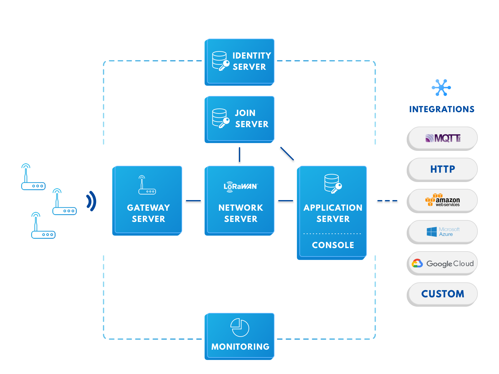

# The Things Network (TTN) - LoRaWAN

- Classificação: Protocolo
- Concepção: 2009
- Lançamento: 2013

LoRaWAN é um protocolo de comunicação feito para ser utilizado com a tecnologia LoRa.

The Things Network (TTN) é uma implementação global de acesso público de uma rede LoRaWAN.

## Características

## Tecnologia LoRa

LoRa é uma tecnologia de comunicação de longa distância e baixo consumo de energia. É uma tecnologia proprietária e patenteada, baseada em Chirp Spread Spectrum (CSS).

Atualmente é a tecnologia com a melhor relação alcançe/consumo de energia, mas existem competidores que chegam bastante próximos e não dependem de tecnologias proprietárias.

As mesmas características que a tornam eficiente em distância e energia fazem com que seja apropriada apenas para transmissões de dados extremadamente pequenos e infrequentes.

LoRa é uma tecnologia de modulação RF apenas, equivalente a camada física do modelo OSI. Isso significa que apenas especifíca como codificar bits em pulsos de radiofrequência e não prove nenhum esquema lógico para transmissão de dados, verificação de integridade, confirmação recebimento, etc.

## Protocolo LoRaWAN

LoRaWAN é um protocolo desenvolvido para acompanhar a tecnologia LoRa. Foi construído para permitir a interoperabilidade entre dispositivos LoRa e fornecer features associados a camadas mais altas do modelo OSI.

Qualquer gateway LoRaWAN é capaz de receber dados de qualquer dispositivo LoRaWAN. Os dados são então transmitidos via IP a um servidor que provê serviços tais como:

- Descarte de pacotes duplicados
- Confirmação de recebimento
- Retransmisão de dados corrompidos
- Ajuste automático de potência de transmissão
- Criptografia ponta-a-ponta

Isso significa que enquanto LoRa provê a camada física da rede, LoRaWAN provê as features necessárias para se construir um rede funcional baseada nesse esquema de transmissão de dados.

Há algumas limitações no protocolo LoRaWAN, principalmente em relação a sua escalabilidade quando há muitos dispositivos. É previsto que com mais de 1000 dispositivos em um raio de 10km haveriam problemas de interferência.

O protocolo LoRaWAN provê os meios para criação de uma rede mais robusta, porém fica a cargo de cada interessado de fato implementar a sua rede.

## Rede The Things Network (TTN)

The Things Network é uma rede LoRaWAN global e de acesso público.

__Isso significa que é possível conectar um dispositivo LoRaWAN a internet usando infraestrutura compartilhada e sem custo, de qualquer lugar do mundo.__

Como LoRaWAN provê apenas as ferramentas para criar uma rede e não a implementação da mesma, o projeto The Things Network surgiu para criar uma implementação global dela.

The Things Network consiste de diversos gateways LoRaWAN operados por indivíduos ao redor do mundo, conectados á uma mesma rede. O acesso a rede é aberto a todo dispositivo LoRaWAN, com restrições de compartilhamento de banda para melhorar sua escalabilidade.

As vantagens para os indvíduos que operam os gateways são que não há necessidade de operar todo o stack de uma rede LoRaWAN, apenas o gateway, que é bastante simples.

Como todo gateway aceita protocolos de qualquer dispositivo, o resultado é uma rede LoRaWAN de alcançe global e acesso aberto e gratuíto.

## Exemplo de uso

## Referências

[Understanding the Limits of LoRaWAN](https://arxiv.org/pdf/1607.08011)

[RFC8376 - Low-Power Wide Area Network (LPWAN) Overview](https://tools.ietf.org/html/rfc8376)

[The Things Network (TTN)](https://www.thethingsnetwork.org/)
