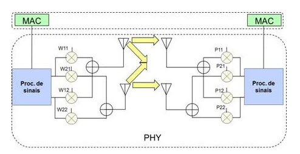

# IEEE 802.11n

- Classificação: IEEE 802.11n-2009 - Wi-fi 4
- Concepção: Primeiros estudos em 2002 e primeiro projeto produzido foi uma versão 2006 - draft
- Lançamento: 2009 como uma melhoria do IEEE 802.11-2007 de 2007

Descrição: O termo Wi-Fi é usado frequentemente como sinônimo para a tecnologia IEEE 802.11. o termo Wi-Fi origina da contração das palavras Wireless Fidelity. 
O Wi-Fi N refere-se a tecnologia IEEE 802.11N: Padrão Wi-Fi para frequência 2,4 GHz e/ou 5 GHz com capacidade de 54 Mbit/s A 72 Mbit/s OPERANDO NO CANAL DE 20Mhz e até 600 Mbps operando no canal de 40Mhz. Esse padrão utiliza como método de transmissão MIMO (multiple-input multiple-output) ou Multiplas Entradas e Múltiplas Saídas onde são utilizadas múltiplas antenas. 
O Wifi-4 já é ultrapassado, levando em consideração que em 2020 já existe o Wifi-6 (Wifi-ax).

Os principais objetivos na criação deste padrão foram:

- Aumento de velocidade e banda para suportar serviços como HDTV (High DefinitionTelevision), VoD (VideoonDemand) entre outros;
- Prover meios que permitissem a interoperabilidade desse padrão com as tecnologias antecessoras.

## Características

### Tecnologia

- Alcance: variável, depende do roteador e da antena podendo chegar a 70 metros
- Velocidade: 54 Mbit/s A 72 Mbit/s OPERANDO NO CANAL DE 20Mhz e até 600 Mbps operando no canal de 40Mhz
- Protocolos: n, mas trabalham com a, b e g, que são os anteriores

### Protocolo

- n, mas trabalham com a, b e g, que são os anteriores
- Método de transmissão: MIMO-OFDM;

### Exemplo de uso

Fonte da imagem: https://www.teleco.com.br/tutoriais/tutorialwifiiee/pagina_4.asp

## Referências

[WiFi - Wikipedia](https://pt.wikipedia.org/wiki/Wi-Fi)

[IEEE 802.11n - Wikipedia](https://pt.wikipedia.org/wiki/IEEE_802.11#802.11n)

[IEEE 802.11n - 2009 - Wikipedia](https://en.wikipedia.org/wiki/IEEE_802.11n-2009)

[IEEE 802.11ax - Wikipedia](https://en.wikipedia.org/wiki/IEEE_802.11ax)

[Diferença entre redes wifi - Minha Conexao](https://www.minhaconexao.com.br/blog/entenda-a-diferenca-entre-as-redes-wifi-a-b-g-n/)

[Tutorial WiFi - Teleco](https://www.teleco.com.br/tutoriais/tutorialwifiiee/pagina_4.asp)

[Diferença entre padrões a, b, g, e n - CanalTech](https://canaltech.com.br/hardware/qual-e-a-diferenca-entre-os-padroes-a-b-g-e-n-dos-roteadores/)
