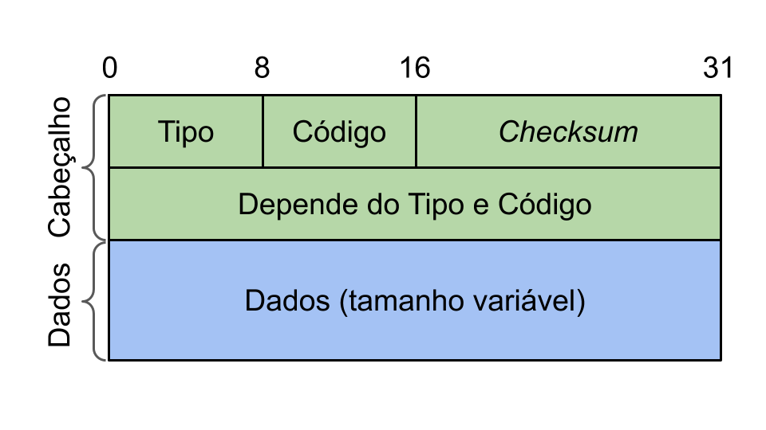

# ICMP 

- Classificação: Protocolo
- Concepção: 1981
- Lançamento: 1981

O _Internet Control Message Protocol_ (ICMP) é utilizado por dispositivos de
rede para reportar problemas encontrados no processamento de pacotes. Uma
mensagem ICMP pode ser disparada, por exemplo, por um _gateway_, para avisar o
remetente de um pacote que o destinatário está inacessível, e portanto o pacote
não pôde ser enviado.

No [modelo OSI](https://en.wikipedia.org/wiki/OSI_model), o ICMP se encontra na
camada de rede, junto ao _Internet Protocol_ (IP). Apesar de parecer um
protocólo de mais alto nível, o ICMP é, na verdade, parte integrante da _suíte
IP_. Todo módulo IP deve também implementar o ICMP, por completo.

## Características

### Definição do Protocolo

A definição do protocolo ICMP para o IPv4 está disponível na
[RFC 792](https://tools.ietf.org/html/rfc792). Já a definição do ICMP para o
IPv6, conhecida por ICMPv6, pode ser encontrada na
[RFC 4443](https://tools.ietf.org/html/rfc4443).

### Confiabilidade e Segurança

O objetivo do ICMP não é tornar confiável (i.e. "_reliable_") o protocolo ao
qual ele dá suporte (i.e. o IP), mas sim reportar problemas. E mesmo assim, os
nós IP não devem assumir que **sempre** receberão mensagens ICMP quando ouver
algum problema de comunicação. Os protocolos de mais alto nível que utilizam o
IP devem implementar seus próprios mecanismos de confiabilidade.

Além disso, mensagens ICMP são roteadas como qualquer outro pacote e, portanto,
também estão sujeitas a sofrer erros e perdas. Nenhuma mensagem ICMP é enviada
para informar erros de processamento nas mensagens ICMP.

### Estrutura do Pacote ICMP

#### Cabeçalho

O cabeçalho ICMP possui 8 bytes, dos quais os 4 primeiros tem formato fixo, e
representam, respectivamente:

- Byte 0: Tipo.
- Byte 1: Código.
- Bytes 2 e 3: _Checksum_.

O par "Tipo, Código" especifica a razão e contexto para envio do pacote ICMP.
Por exemplo, se um dispositivo deseja avisar ao remetente que não foi possível
atingir o destinatário porque a porta especificada não estava disponível, ele
deve enviar uma mensagem ICMP de tipo `3` e código `3`.

O conteúdo dos 4 bytes seguintes depende do código e tipo. Para algumas
combinações de código e tipo, esses 4 bytes não são utilizados.

#### Sessão de Dados

A sessão de dados do ICMP tem tamanho variável. Ao reportar erros, essa sessão
geralmente contém uma cópia completa do cabeçalho IP que originou o erro, junto
de 8 bytes de dados do pacote IP original. Essa informação é útil ao
destinatário do pacote ICMP para decidir à qual processo deve encaminhar o erro.

Como veremos adiante, além de reportar erros, o protocolo ICMP também pode ser
utilizado para diagnóstico de rede. Nestes casos, a sessão de dados possui
outro conteúdo.

### Uso para Diagnósticos

Apesar do ICMP ter no **relatório de erros** o seu objetivo principal, ele
também pode ser utilizado para **diagnósticos de rede**. Dois utilitários de
terminal muito famosos que utilizam o ICMP para o propósito de diagnóstico são
o `traceroute` e o `ping`.

O primeiro permite monitorar o caminho feito por uma serie de pacote de uma
máquina a outra. Já o segundo nos permite diagnosticar a velocidade e latência
de conexão entre duas máquinas, medindo o tempo gasto para enviar e receber
um pacote ICMP especial, apelidado de "echo".

Ao receber um pacote echo, chamado de "echo request", o destinatário prepara
uma resposta (ou "echo reply"), da seguinte forma:

- Inverte os campos "destinatário" e "remetente"
- Altera o tipo para 0
- Recalcula o _checksum_.

Então o pacote é enviado de volta. Assim,  a maquina que enviou o _request_
enxerga seu pacote "ecoando" de volta, e pode calcular, dentre outras
informações, a velocidade de conexão. O par "tipo, código" de um _echo request_
é _8,0_. E para um _echo reply_, _0,0_.

## Referências

- [RFC 792](https://tools.ietf.org/html/rfc792)
- [RFC 4443](https://tools.ietf.org/html/rfc4443)
- [Wikipedia ICMP](https://en.wikipedia.org/wiki/Internet_Control_Message_Protocol)
- [Cloudflare: What is the Internet Control Message Protocol (ICMP)?](https://www.cloudflare.com/learning/ddos/glossary/internet-control-message-protocol-icmp/)
- [Slides do LPRM - UFES](http://www.inf.ufes.br/~zegonc/material/Redes_de_Computadores/O%20Protocolo%20ICMP.pdf)

