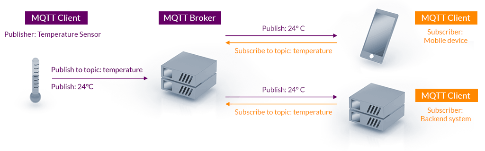

# MQTT

- Classificação: Protocolo
- Concepção: 1999
- Lançamento: 2013

Descrição: MQTT é um protocolo de mensageria para IoT, baseado no paradigma de publicação e subscrição.
Permite conectar dispositivos com um protocolo leve, suporta mecanismos de segurança, e comunicação orientada a eventos.
Suporta implantação local ou em nuvem.

## Características

### Protocolo

- Padronizado pela OASIS em 2014
- MQTT pode ser executado como protocolo da camada de aplicação com o TCP/IP, ou outros protocolos que permitem comunicação bidirecional.
- Dispositivos podem se inscrever em tópicos que tem interesse, e também podem publicar em tópicos
- O responsável pelo tratamento das mensagens é uma entidade chamada broker, que pode ser implantada localmente, ou em um ambiente de computação em nuvem.

### Exemplo de uso

Neste exemplo, um dispositivo IoT (esquerda) com um sensor de temperatura é um cliente MQTT, que publica um valor de 24°C no tópico "temperatura".

O broker MQTT (meio) é o responsável pela retransmissão da mensagem para outros dois clientes MQTT, inscritos no tópico "temperatura" (direita).

Assim, o valor de 24°C encapsulado como *payload* no protocolo MQTT chega no sistema back-end e no dispositivo móvel, para que este evento seja útil para outras aplicações.

## Referências

[MQTT Version 5.0. Edited by Andrew Banks, Ed Briggs, Ken Borgendale, and Rahul Gupta. 07 March 2019. OASIS Standard](https://docs.oasis-open.org/mqtt/mqtt/v5.0/mqtt-v5.0.html)

[MQTT website](https://mqtt.org/)

[HiveMQ MQTT 5.0 Series](https://www.hivemq.com/blog/mqtt5-essentials-part1-introduction-to-mqtt-5/)
