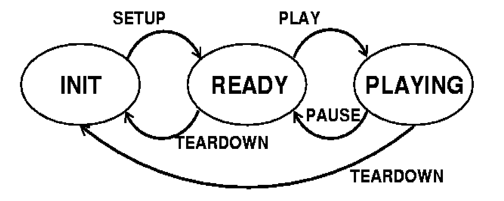
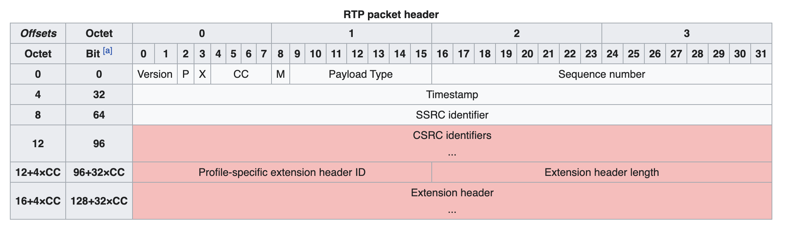

# Real Time Streaming Protocol (RTSP)

- Classificação: Protocolo
- Concepção: 1996 pela Real Networks, Netscape and Columbia University
- Lançamento: 1998 (Versão 1.0, RFC2326)
- Última atualização: 2016 (Versão 2.0, RFC7826)

O Real Time Streaming Protocol (RTSP) é usado para transmissão de dados de multimídia em tempo real. Os comandos desse protocolo (por exemplo, Play, Record, Pause) são inspirados pelo tocador de fita VHS. Apesar sua idade, RTSP é amplamente disseminado em aplicações de IOT como por exemplos câmeras de vigilância, drones ou robôs.

## Protocolo

- ITEF RFC7826 [RTSP]
- ITEF RFC3550 [RTP e RTCP]
- Câmeras de vigilância, drones, robôs

## Características

O RTSP é usado exclusivamente para o envio de comandos de controle e se baeseia no TCP. O envio dos dados de multimídia será feito via o RTP (Real-time Transport Protocol) e RTCP (Real-time Control Protocol), que se baseia principalmente no UDP. Porém, um envio por TCP também é possível mas costuma ser menos eficiente.  

O RTSP trabalha com estados que são alterados através dos comandos do RTCP. Os principais estados e comandos são ilustrados na imagem encima.

Além dos comandos básicos (SETUP, PLAY, PAUSE, TEARDOWN) existem comandos adicionais como OPTIONS, DESCRIBE, PLAY_NOTIFY, GET_PARAMETER, SET_PARAMETER e REDIRECT. A maioria dos dados são enviados do cliente para servidor, mas alguns comandos (GET_PARAMETER, REDIRECT, PLAY_NOTIFY) são enviados do servidor para o cliente.

O RTP é desenhado de forma flexível para poder trabalhar com formatos de *payloads* diferentes. O RTP envia os dados usando o *header* ilustado embaixo. O RTCP serve para monitorar o envio de dados e controlar a qualidade do serviço.

### Exemplo de uso

Para iniciar o envio de dados precisa da inicialização da conexão:

    C->S: SETUP rtsp://example.com/media.mp4/streamid=0
          RTSP/1.0
          CSeq: 3
          Transport: RTP/AVP;unicast;client_port=8000-8001

    S->C: RTSP/1.0 200 OK
          CSeq: 3
          Transport: RTP/AVP;unicast;client_port=8000-8001;server_port=9000-9001;ssrc=1234ABCD
          Session: 12345678

Uma vez de ter uma sessão inicializada, podemos pedir o envio dos dados de multimídia:

    C->S: PLAY rtsp://example.com/media.mp4 RTSP/1.0
          CSeq: 4
          Range: npt=5-20
          Session: 12345678

    S->C: RTSP/1.0 200 OK
          CSeq: 4
          Session: 12345678
          RTP-Info: url=rtsp://example.com/media.mp4/streamid=0;seq=9810092;rtptime=3450012

Para interromper o envio dos dados de multimídia pode ser emitido o comando de PAUSE:

    C->S: PAUSE rtsp://example.com/media.mp4 RTSP/1.0
          CSeq: 5
          Session: 12345678

    S->C: RTSP/1.0 200 OK
          CSeq: 5
          Session: 12345678

Para liberar recursos no servidor, deve se encerrar a sessão:

    C->S: TEARDOWN rtsp://example.com/media.mp4 RTSP/1.0
          CSeq: 8
          Session: 12345678

    S->C: RTSP/1.0 200 OK
          CSeq: 8 

## Referências

[ITEF, RFC7826 - Real-Time Streaming Protocol Version 2.0, December 2016, ISSN: 2070-1721](https://tools.ietf.org/html/rfc7826)

[ITEF, RFC3550 - RTP: A Transport Protocol for Real-Time Applications, July 2003](https://tools.ietf.org/html/rfc3550)

[Wikipedia, Real Time Streaming Protocol, 27 de Setembro 2020](https://en.wikipedia.org/wiki/Real_Time_Streaming_Protocol)

[Wikipedia, Real-time Transport Protocol, 27 de Setembro 2020](https://en.wikipedia.org/wiki/Real-time_Transport_Protocol)

[RED5PRO - 4 Reasons RTSP Streaming is Still Relevant, 27 de Fevereiro 2020](https://www.red5pro.com/blog/4-reasons-rtsp-streaming-is-still-relevant/)

[Edson Moreira e Roberto Sadao, Streaming vídeo com RTSP
e RTP](http://wiki.icmc.usp.br/images/4/43/RTP-RTSP-slides.pdf)
