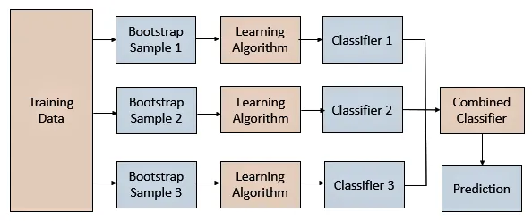

# Algoritmo Bootstrap Aggregating (Bagging)

- Tipo de aprendizado: N/A
- Subcategoria: Meta - Algoritmo utilizado para aumento da precisão de preditores.
- Leo Breiman: Bagging Predictors, 1996

## Descrição

### Onde é usado (tecnicamente)

O Bagging é um meta-algoritmo que busca o aumento da precisão dos preditores por meio da geração de sub populações (bootstrap) de treinamento e consolidação dos resultados obtidos em um preditor final. A vantagem dessa técnica é que as sub populações são geradas a partir de amostras da população original, não havendo a necessidade de aumento ou obtenção de novos dados e, mesmo assim, a técnica demonstrou ter capacidade de aumentar a precisão dos algoritmos. Adicionalmente, a capacidade de paralelização por meio da execução concorrente dos treinamentos nas sub populações, se mostra como mais uma vantagem dessa abordagem.

### Como é utilizado

Esse método demonstrou sua efetividade em preditores instáveis (Ex. Redes neurais, árvores de classificação e regressão e seleção de variáveis em regressão linear). De acordo com Alexandre Rubesam em sua dissertação, 2004, um preditor é instável se pequenas perturbações no conjunto de treinamento causam grande variações nos preditores treinados com ele. A técnica de bagging não é indicada para ser aplicada em algoritmos Nearest Neighbors.

### Exemplos de caso de uso

Em seu artigo de apresentação, Leo Breiman aplicou o bagging em aliado ao algoritmo de árvores de classificação e regressão. No seu experimento ele utilizou datasets publicados pela UCI e obteve reduções significativas no erro dos modelos quando a técnica de bagging foi aplicada.

## Referências
[Leo Breiman](https://www.stat.berkeley.edu/~breiman/bagging.pdf)
[Dissertação Rusam, Alexandre](http://repositorio.unicamp.br/jspui/bitstream/REPOSIP/306510/1/Rubesam_Alexandre_M.pdf)
[Corporate Finance Institute.](https://corporatefinanceinstitute.com/resources/knowledge/other/bagging-bootstrap-aggregation/)

