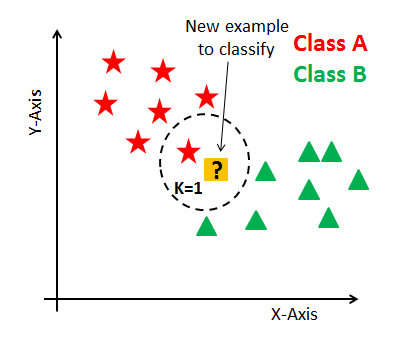

# Algoritmo (Nome)

- Tipo de aprendizado: Supervisionado, não-supervisionado, reforço
- Subcategoria: Clusterização, Classificação, etc
- Autoria: Artigo, Ano

## Descrição

### Onde é usado (tecnicamente)

Utilizado para classificar um novo dado desconhecido.

### Como é utilizado

Precisa de um conjunto de treinamento, um conjunto de testes, e variar parâmetros para melhor ajustar a novas entradas.

### Exemplos de caso de uso

Classificação de regularidades em padrão de navegação.

## Referências

[Inferir](inferir.com.br)