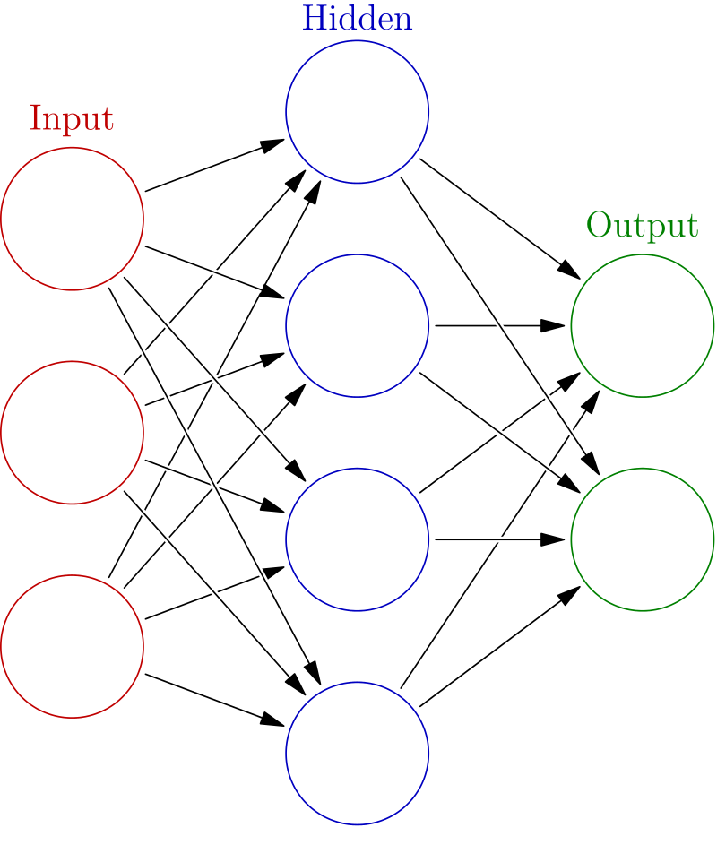

# Artificial Neural Networks ou Neural Networks

- Tipo de aprendizado: Supervisionado
- Subcategoria: Clusterização, Classificação, Regressão, Filtragem e Compressão
- Autoria: McCulloch, Warren; Walter Pitts (1943). "A Logical Calculus of Ideas Immanent in Nervous Activity".

## Descrição

### Onde é usado

É usado para aproximar funções, classificar um conjunto de dados, processar dados e para o controle de dispositivos robóticos.

### Como é utilizado

As ANNs aprendem processando um conjunto de dados que possui valores de *input* e *output*. Através do treinamento é possível formar associações de probabilidade entre os valores de *input* e o *output*, e a cada iteração a rede ajusta os valores dessas probabilidades de acordo com a diferença entre o *output* produzido pela rede e o *output* alvo, ou seja, de acordo com o erro. 

### Exemplos de caso de uso

Controle de veículos, reconhecimento de padrões, diagnósticos médicos, finanças, visualização de dados, mineração de dados e filtro de spam.

## Referências

[Wikipédia](https://en.wikipedia.org/wiki/Artificial_neural_network#History)

