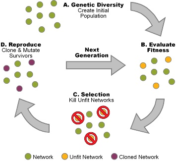

# Algoritmos Genéticos

- Tipo de aprendizado: Não-supervisionado
- Subcategoria: Otimização de parâmetros
- Autoria: Vários - Notavelmente Fraser e Burnell, 1970

## Descrição

### Onde é usado (tecnicamente)

Algoritmos genéticos são uma família de técnicas para otimização de parâmetros em diversos algoritmos, inspirado nos princípios de seleção natural.

### Como é utilizado

Algoritmos genéticos são bastante flexíveis. Para aplica-los é necessário, primeiramente, uma forma de separar e "mutar" os parâmetros que estão sendo otimizados.

Também é necessário uma forma de medir a performance de cada variante do algoritmo com os parâmetros mutados (ou seja, uma função fitness).

O algoritmo genético tenta então otimizar os parâmetros criando variantes escolhendo os melhores em uma certa população, misturando os seus parâmetros e testando os "filhos" novamente, de forma recursiva.

### Exemplos de caso de uso

Algorítmos genéticos são bastante flexíveis e podem ser usados em divesas aplicações. Essa flexibilidade faz com que, em geral, não sejam a forma mais eficiente de resolver problemas específicos e portanto não são tão usados na prática.

Como exemplo, redes neurais podem ser treinadas com algoritmos genéticos ao invés de backpropragation, embora isso não seja muito prático na maior parte das vezes.

Casos em que algoritmos genéticos são usados na prática em geral envolvem modelagem ou otimização de objetos físicos. Por exemplo, existem antenas que são atualmente usadas em satélites que foram desenhadas por algoritmos genéticos, designs de espelhos para reflexão de luz solar, otimização aerodinâmica de formas, etc. 

## Referências

[Wiki](https://en.wikipedia.org/wiki/Genetic_algorithm)