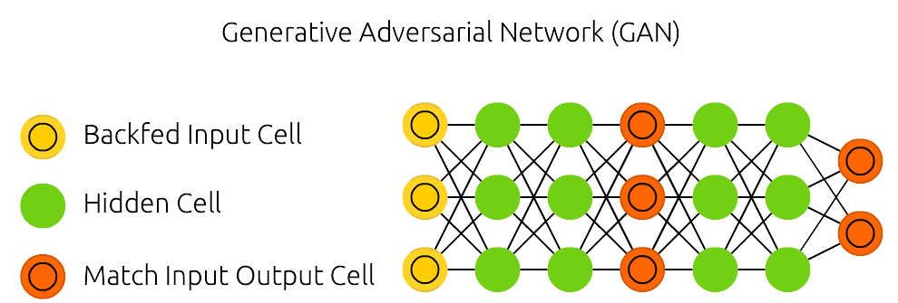

# Generative Adversarial Networks

- Tipo de aprendizado: Não-supervisionado, supervisionado, podendo, inclusive, ser por reforço
- Subcategoria: Classificação, geração e regressão
- Autoria: Goodfellow, Ian, et al. *“Generative adversarial nets.” Advances in Neural Information Processing Systems* (2014).

## Descrição

Esse algoritmo realiza a disputa entre duas (ou mais) redes neurais em uma epécie de [jogo de soma-zero](https://pt.wikipedia.org/wiki/Soma-zero), uma (gerador) realiza a função de *ataque* gerando, a partir de um conjunto de treinamento, dados com a função de *enganar* a outra rede (discriminador) que é treinada para diferenciar os dados gerados pela rede atacante dos dados de seu conjunto de treinamento (ou teste).

O resultado final é a geração de um conjunto de dados sintéticos com características muito próximas dos conjuntos de dados de treinamento e teste, podendo, inclusive, ser indistiguível a um humano a manipulação do mesmo.

### Onde é usado (tecnicamente)

Usado para treinamento de um modelo gerador, que, por sua vez, pode ser usado para treinar um modelo discriminativo.

### Como é utilizado

Dado um conjunto de treinamento e duas redes neurais, uma para geração e outra para classificação, a GAN deve ser capaz de ser treinada de forma não-supervisionada, podendo sê-la de forma supervisionada ou por reforço a fim de otimizar o discriminador e/ou gerador.

### Exemplos de caso de uso

Utilizado como gerador de mídias sintéticas, como [Deepfake](https://pt.wikipedia.org/wiki/Deepfake), ou para geração de *Arte de Inteligência Artificial*; mas também para realizar a expansão de um conjunto de treinamento para um outro algoritmo de aprendizagem, assim como aumento de resoluções e reconstrução de dados a partir de recortes dos mesmos.

### Diagrama da Rede

Fonte: [Neural Network Zoo](https://www.asimovinstitute.org/neural-network-zoo/)

## Referências

[Artigo Original](https://arxiv.org/pdf/1406.2661v1.pdf)

[Wikipedia](https://en.wikipedia.org/wiki/Generative_adversarial_network) 

[Azimov Institute](https://www.asimovinstitute.org/neural-network-zoo/)
