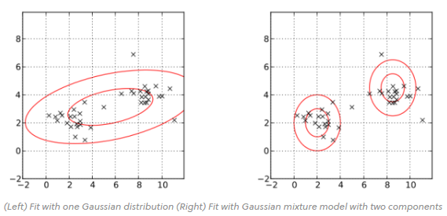
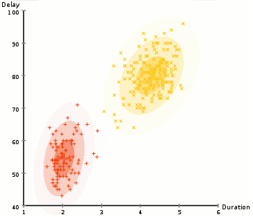

# Gaussian Mixture Model (GMM)

- Tipo de aprendizado: Não-supervisionado
- Subcategoria: Clusterização
- Autoria: n/a

## Descrição

Gaussian Mixture Model (GMM), ou Modelo de mistura gaussiana, é um algoritmo não-supervisionado, para representar distribuições normais de subpopulações contidas em uma população.

### Onde é usado (tecnicamente)

Utilizado para clusterização de dados, ou seja, identificação de agrupamentos de dados com características similares, representados por distribuições normais, de um conjunto de dados (dataset) maior analisado.

### Como é utilizado

Precisa de um conjunto de dados (dataset) e variar parâmetros para melhor ajustar a clusterização.
Parâmetros comuns:
- Número de componentes, ou número de distribuições normais para representar o conjunto de dados analisado.
- Covariância, que determina a forma do agrupamento, que pode variar entre esférico (todas as dimensões iguais) e elíptico (com orientação fixa em um eixo ou arbitrária).

### Exemplos de caso de uso

Pode ser utilizado para agrupar dados com características similares. Por exemplo, pode ser utilizado para dividir uma imagem em segmentos de pixels similares para análise posterior.

## Referências

[Gaussian Mixture Model](https://brilliant.org/wiki/gaussian-mixture-model/)

[Gaussian Mixture Models Explained](https://towardsdatascience.com/gaussian-mixture-models-explained-6986aaf5a95)

[Python Data Science Handbook](https://colab.research.google.com/github/jakevdp/PythonDataScienceHandbook/blob/master/notebooks/05.12-Gaussian-Mixtures.ipynb#scrollTo=QJYm9MUw7JRE)

[Segmentação de imagem com um modelo mistura gaussiano](https://www.wolfram.com/language/11/extended-probability-and-statistics/image-segmentation-with-gaussian-mixture-model.html?product=language)
