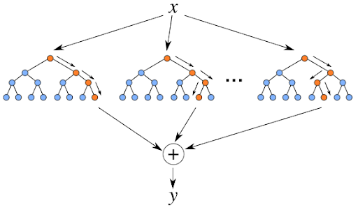

# RandomForest

- Tipo de aprendizado: Supervisionado
- Subcategoria: Regressão/Classificação

Este algoritmo trabalha com a criação de várias arvores de decisão aleatoriamente, formando uma floresta na qual cada arvore é utilizada para se obter o resultado final. 

O método usado consiste em uma combinação de diferentes modelos para se obter um único resultado, tornando assim, um algoritmo mais robusto e complexo, exigindo um poder computacional maior.

Vantagens do algoritmo

- Alta velocidade de aprendizagem
- Aprendizado não iterativo — o algoritmo é concluído em um número fixo de operações
- Escalabilidade (capacidade de lidar com grandes quantidades de dados)
- Alta qualidade dos modelos obtidos (comparável com as redes neurais e os ensembles de redes neurais)
- Sem sensibilidade aos picos nos dados devido a amostragem aleatória
- Um pequeno número de parâmetros configuráveis
- Sem sensibilidade ao dimensionamento dos valores das características (e a qualquer transformação monótona em geral) devido à seleção de subespaços aleatórios
- Não requer uma configuração cuidadosa dos parâmetros, funciona bem fora da caixa. O "ajuste" dos parâmetros permite um aumento na precisão de 0,5% a 3%, dependendo da tarefa e dos dados.
- Funciona bem com dados ausentes — mantém uma boa precisão, mesmo que uma grande parte dos dados estejam ausente.
- Avaliação interna da capacidade de generalização do modelo.
- A capacidade de trabalhar com dados brutos, sem pré-processamento.

## Descrição

### Onde é usado (tecnicamente)

A subcategoria desse algoritmo, pode ser usado como regressão (média dos valores para obtenção do resultado final) e em classificação, no qual o resultado que mais se repetir será o escolhido.

### Como é utilizado

Como citado na introdução, o algoritmo é utilizado com a combinação de diferentes modelos para se obter um único resultado, serão criadas várias árvores de decisão. Cada arvore pode ser considerado um modelo, se criarmos por exemplo 100 modelos, teremos 100 resultados, que serão agregados em apenas um.

Serão criados vários modelos diferentes a partir de um algoritmo, assim construindo várias arvores de decisão e combinando entre eles para chegar em um resultado final:

O algoritmo criará uma estrutura similar a um fluxograma, com “nós” onde uma condição é verificada, e se atendida o fluxo segue por um ramo, caso contrário, por outro, sempre levando ao próximo nó, até a finalização da árvore.

Todos passos executados pelo algoritmo serão selecionados aleatoriamente algumas amostras dos dados de treino, nunca repetindo as amostras já selecionadas. 

### Exemplos de caso de uso

Estatística, mineração de dados, aprendizado de máquina e etc...

## Referências

[Artigo - FLORESTA DE DECISÃO ALEATÓRIA NA APRENDIZAGEM POR REFORÇO](https://www.mql5.com/pt/articles/3856)
[didática](https://didatica.tech/o-que-e-e-como-funciona-o-algoritmo-randomforest/#:~:text=Em%20portugu%C3%AAs%2C%20Random%20Forest%20significa,na%20escolha%20do%20resultado%20final.)
