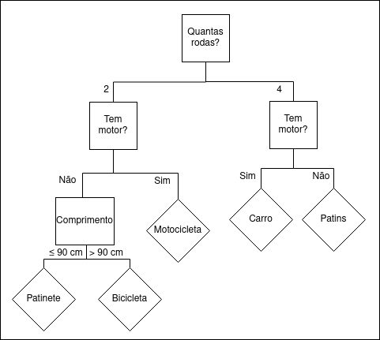

# Árvore de Decisão

- Tipo de aprendizado: Supervisionado
- Subcategoria: Classificação e regressão

## Descrição

Uma árvore de decisão é um modelo em forma de árvore, constuido de diversas
perguntas simples (ou decisões) em seus nós não terminais, e classes (ou
resultados) nas folhas. A partir de uma tupla de valores, percorre-se a árvore
respondendo as perguntas sobre os dados, até se chegar em uma folha, que contém
a classificação daquela tupla.

Árvores de decisão podem ser usadas tanto em um contexto mais "manual", para
auxiliar e visualizar um processo de tomada de decisão, como no contexto de
aprendizado de máquina, para algoritmicamente prever a melhor alternativa a
partir de um conjunto de informações.

### Onde é usado (tecnicamente)

Árvores de Decisão são utilizadas para classificar dados desconhecidos. Se o
conjunto de classes forem números reais, chamamos a árvore de "Árvore de
Regressão".

### Como é utilizado

Existem diversos algoritmos de aprendizado que podem ser empregados para gerar
árvores de decisão. E frequentemente, sobre estes algoritmos são acrescentadas
técnicas e processos como "pruning" e "enseble learning", para melhorar a
qualidade do preditor gerado. Mas de forma geral, um algoritmo para gerar
árvores de decisão almeja deduzir quais perguntas realizar em cada passo, de
forma a maximizar a segregação dos dados de treinamento (com base nos rótulos
ou classes fornecidos). Isso é geralmente feito com algoritmos gulosos.

### Exemplos de caso de uso

- Predizer o preço de um carro, dado um conjunto de caractéristicas sobre ele.
- Predizer o valor de um apartamento, dado características do bairro e condominio.
- Etc.

### Vantagens

- Fácil de interpretar e explicar, mesmo para usuários não-técnicos.
- Diferente de alguns outros algoritmos, árvores de decisão não requerem muito
  pré-processamento nos dados de treinamento.
- Funciona tanto para dados númericos como categóricos.

### Desvantagens

- Árvores de decisão podem se tornar extremamente complexas e falharem em
  generalizar os dados (overfitting).
- Se o conjunto de dados é desbalanceado (com alta predominancia de algumas
  classes), algoritmos de aprendizado podem gerar árvores de decisão enviesadas.
- Árvores de decisão não conseguem expressar alguns conceitos facilmente,
  tornando alguns conceitos mais dificeis de serem aprendidos. E.g. XOR e
  problemas de paridade.

## Referências

1. [http://www.stat.cmu.edu/~cshalizi/350-2006/lecture-10.pdf](http://www.stat.cmu.edu/~cshalizi/350-2006/lecture-10.pdf)
2. [https://scikit-learn.org/stable/modules/tree.html](https://scikit-learn.org/stable/modules/tree.html)
3. [https://www.youtube.com/watch?v=LDRbO9a6XPU](https://www.youtube.com/watch?v=LDRbO9a6XPU)
4. [https://towardsdatascience.com/decision-trees-in-machine-learning-641b9c4e8052](https://towardsdatascience.com/decision-trees-in-machine-learning-641b9c4e8052)
5. [https://www.lucidchart.com/pages/decision-tree](https://www.lucidchart.com/pages/decision-tree)
