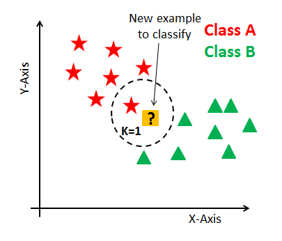

# K-Nearest Neighbors

- Tipo de aprendizado: Supervisionado
- Subcategoria: Classificação e regressão
- Autoria: [Cover, Thomas M.; Hart, Peter E. (1967). "Nearest neighbor pattern classification"]((http://ssg.mit.edu/cal/abs/2000_spring/np_dens/classification/cover67.pdf))

## Descrição

Esse algoritmo é um tipo de "aprendizagem preguiçosa", na qual a geração de predições é postergada até o momento da classificação.

### Onde é usado (tecnicamente)

É utilizado em aplicações onde as predições não são requisitadas frequentemente, mas precisam ter alta precisão.

### Como é utilizado

Ele usa "similaridade de características" para prever os valores de novos pontos de dados, o que quer dizer que a um novo datapoint será designado um valor baseado em quão perto ele está dos dados de treinamento. 

Por isso, ele precisa de um dataset de treinamento e de um valor fixo de K (ou seja, ele considerará os K mais próximos elementos).

### Exemplos de caso de uso

Cálculo de avaliação de crédito.

## Referências

[Wikipedia](https://en.wikipedia.org/wiki/K-nearest_neighbors_algorithm#References)

[IBM](https://www.ibm.com/support/knowledgecenter/en/SS6NHC/com.ibm.swg.im.dashdb.analytics.doc/doc/r_knn.html)

[Tutorialspoint](https://www.tutorialspoint.com/machine_learning_with_python/machine_learning_with_python_knn_algorithm_finding_nearest_neighbors.htm)