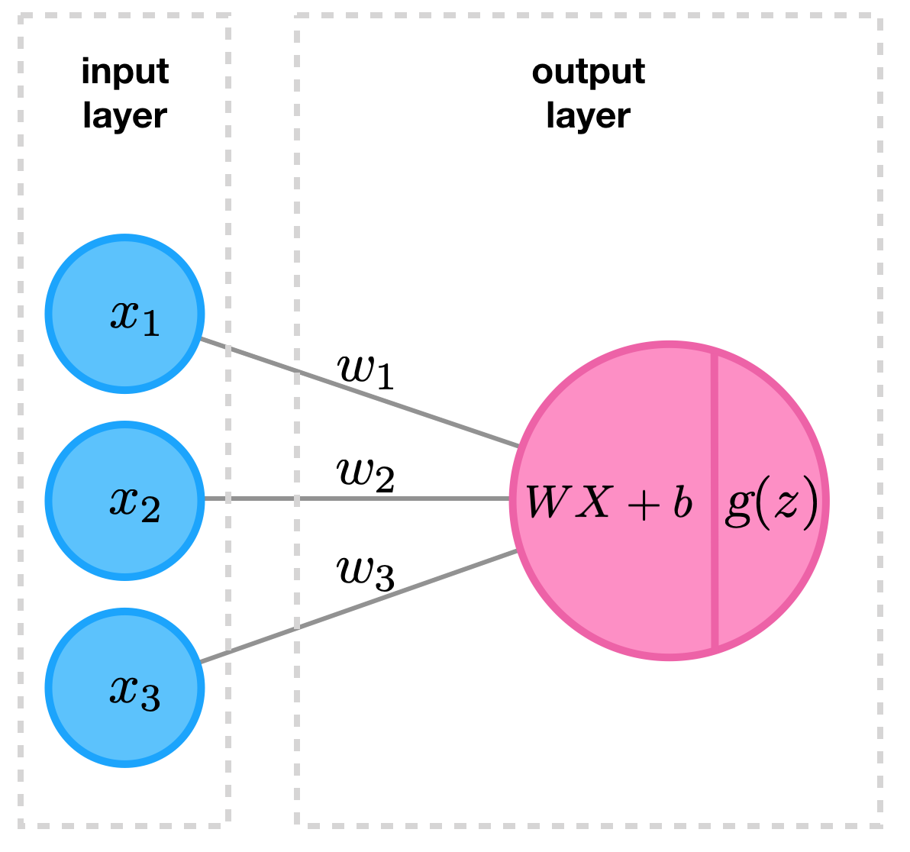
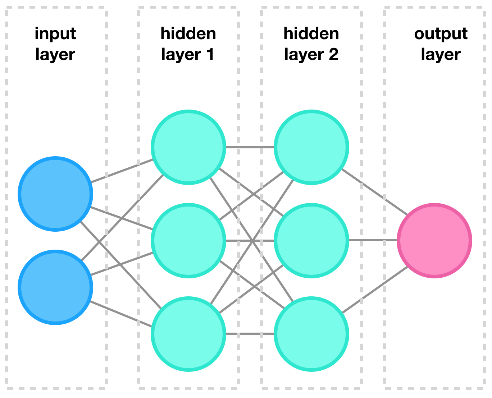
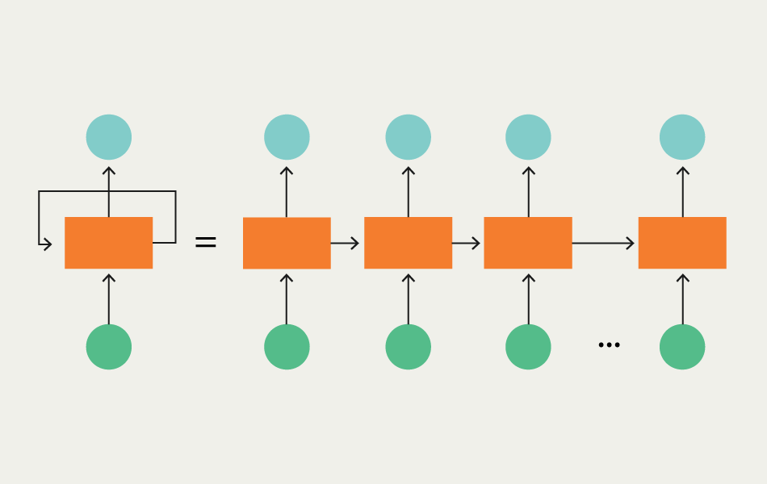
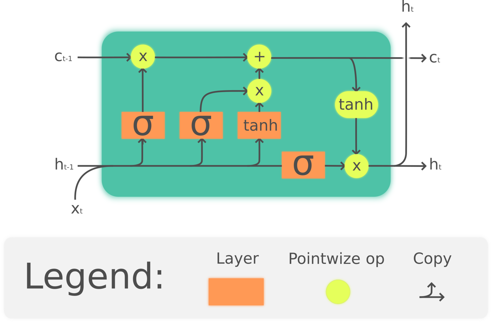
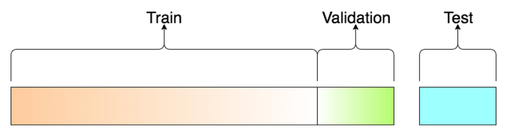

# Algoritmo de LSTM(Long Short-Term Memory)

- Tipo de aprendizado: Supervisionado
- Subcategoria: Classificação & Predição
- Autoria: S Hochreiter, J Schmidhuber - Neural computation, 1997 - MIT Press

## Descrição

O algoritmo de LTSM é considerado uma rede neural recorrente (RNN - Recurrent Neural Network) de segunda geração, que é usado para classificação e predição de series temporais.

Uma rede neural usa neurons como elemento básico. Um neuron é uma função matemática que soma as valores da sua entrada, multiplicado por pesos individuais. O resultado dessa soma passa por um transformação não linear na sua saída. Essa transformação também e chamado função de ativação.

Normalmente os neurons são organizadas em camadas, muitas vezes profundas, conectando as saídas de uma camada nas entradas da próxima camada. Essa arquitectura de redes neurais é usado para a classificação de informações diversas (por exemplo conjunto de dados) ou para classificar imagens.

No caso de series temporais (por exemplo sinais de audio, EGC, etc.) uma arquitectura de redes neurais se comprovou mais eficaz: Redes Neurais Recorrentes. Nesse caso a rede não lê todos os dados de uma vez só, mas processa o sinal iterativamente. Cada iteração a rede lê uma parte do sinal e calcula duas saídas: Um "resultado final" daquela iteração e um "resultado intermediário" que será retro-alimentado na própria rede durante a próxima iteração.

O LSTM (Long short-term Memory) é uma implementação específica de RNN's que endereça o problema que algumas informações processados precisam ser guardados e passados adiantes por muitas iterações de processamento para ter uma classificação mais eficaz. Por isso o LTSM oferece duas saídas de "resultados intermediários", uma para ser processado no curto prazo e um para ajudar em processamentos de longo prazo.

### Onde é usado (tecnicamente)

O LSTM pode ser usado para a classificação de sinais, como por exemplo o reconhecimento de voz. Aplicações mais avançados incluem traduções de texto ou a geração de conteúdo automático (textos ou musica).

### Como é utilizado

O LTSM é treinado como todos outros redes neurais: Após de ter aplicado um conjunto de dados de treinamentos à rede neural, será calculado um ajuste dos pesos de cada neuron para diminuir o erro da rede. Esse calculo acontece
de "traz para frente", e se chama por tanto backpropagation.

Além do conjunto de dados de treinamento há um conjunto de dados de validação para ter uma medição da qualidade do ciclo de aprendizagem e para ajudar no ajuste de hiperparâmetros, como por exemplo a taxa de aprendizagem. Opcionalmente existe um conjunto de dados de teste para medir a qualidade do resultado final.

### Exemplos de caso de uso

Exemplos nos possíveis aplicações do LTSM são:

- Classificação de sinais de ECG
- Classificação de ondas cerebrais
- Identificar o status de equipamento Industrial e predição de falhas
- Previsão do fator de potência em redes de energia

## Referências

[L. Ambalina, What is the Difference Between CNN and RNN?, Lionbridge, March 2020](https://lionbridge.ai/articles/difference-between-cnn-and-rnn/s)

[D. Bakhuis, A neural network from scratch, Towards Data Science, May 2020](https://towardsdatascience.com/a-neural-network-from-scratch-c09fd2dea45d)

[Guru99, Back Propagation Neural Network: Explained With Simple Example](https://www.guru99.com/backpropogation-neural-network.html)

[Kearney, Setting Up Test, Validation, And Training Sets Of Data, 2019](http://www.dailysmarty.com/posts/setting-up-test-validation-and-training-sets-of-data)

[Kumar et. al, Brain wave classification using long short-term memory network based OPTICAL predictor, Scientific Reports, 2019](https://www.nature.com/articles/s41598-019-45605-1)

[A. Ng, Deep Learning Specialization - Sequence Models, deeplearning.ai](https://www.deeplearning.ai/deep-learning-specialization/)

[Saadatnejad, Oveisi, and Hashemi,LSTM-Based ECG Classification for Continuous Monitoring on Personal Wearable Devices,](https://arxiv.org/pdf/1812.04818.pdf)

[F Simplicio., Previsão do Fator de Potência via Redes Neurais Artificiais Recorrentes LSTM (Long Short Term Memory) na Plataforma IOT geniot PRO Industrial](https://www.universidadeiot.com.br/previsao-do-fator-de-potencia-via-redes-neurais-artificiais-recorrentes-lstm-long-short-term-memory-na-plataforma-iot-geniot-pro-industrial/)

[Wikipedia, Long short-term memory](https://en.wikipedia.org/wiki/Long_short-term_memory)

[Zhang et. al., LSTM-based Analysis of Industrial IoT Equipment, IEEE Access, April 2018](https://www.researchgate.net/publication/324468813_LSTM-based_Analysis_of_Industrial_IoT_Equipment)
