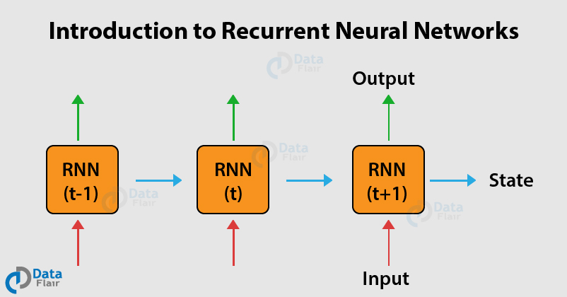

# RNN (Recurrent Neural Networks)

- Tipo de aprendizado: Supervisionado ou não-supervisionado, dependendo do caso de uso.
- Subcategoria: Aprendizagem profunda (*Deep Learning*)
- Autoria: Williams, Ronald J.; Hinton, Geoffrey E.; Rumelhart, David E. **Learning representations by back-propagating errors.**, Outubro de 1986

## Descrição

### Onde é usado (tecnicamente)

RNNs são redes neurais onde conexões entre seus nós formam um grafo direcionado ao longo de uma sequência temporal. Isso permite que elas derivem resultados baseados em séries históricas, podendo distribuir pesos ao longo da série. São mais comumente utilizadas nas áreas de NLP (natural language processing) e reconhecimento de fala. Também podem ser utilizadas para o reconhecimento de texto manuscrito em imagens.

### Como é utilizado

Existem muitos tipos de RNNs, que podem ser utilizadas em diferentes situações. Mas de forma geral, essas redes recebem como *entrada* séries temporais, como: preços diários de um certa ação, sentenças, medições de um sensor ao longo do tempo. Cada entrada é processada individualmente, e a rede vai mantendo uma "memória" com base nos dados que vai processando. A sua característica *recorrente* vem do fato de que, a saída produzida pela rede com um certo dado, passa a servir de entrada para a análise do próximo dado da série. Essa característica é o que permite que a rede leve em consideração dependências de longo-prazo, já que ela sempre leva em consideração o contexto completo, carregado de um resultado para o próximo por meio de um estado.

### Exemplos de caso de uso

- Tradução de textos feito por computadores;
- Previsões baseadas em séries históricas (por exemplo, preços de ações);
- Reconhecimento de fala;
- Reconhecimento de escrita.

## Referências

- [Stanford CS 230](https://stanford.edu/~shervine/teaching/cs-230/cheatsheet-recurrent-neural-networks)
- [Wikipedia](https://en.wikipedia.org/wiki/Recurrent_neural_network)
- [Data Flair](https://data-flair.training/blogs/recurrent-neural-networks/)