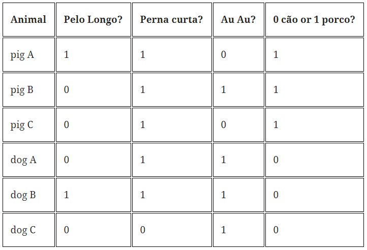

# Algoritmo (SVM - Support Vector Machine - Máquina de Vetores de Suporte

- Tipo de aprendizado: Não-supervisionado
- Subcategoria: Classificação
- Autoria: AT&T Bell Laboratories por Vapnik (Boser et al., 1992, Guyon et al., 1993, Vapnik et al., 1997)

## Descrição
Uma máquina de vetores de suporte (SVM, do inglês: support vector machine) é um conceito na ciência da computação para um conjunto de métodos de aprendizado supervisionado que analisam os dados e reconhecem padrões, usado para classificação e análise de regressão.
Em um base de dados, cada item é marcado como pertencente a uma de duas categorias, um algoritmo de treinamento do SVM constrói um modelo que atribui novos exemplos a uma categoria ou outra. Um modelo SVM é uma representação de exemplos como pontos no espaço, mapeados de maneira que os exemplos de cada categoria sejam divididos por um espaço claro que seja tão amplo quanto possível. Os novos exemplos são então mapeados no mesmo espaço e preditos como pertencentes a uma categoria baseados em qual o lado do espaço eles são colocados.

### Onde é usado (tecnicamente)
É utilizado para agrupar dados de acordo com características pré-definidas, como clientes, animais, situações, etc...

### Como é utilizado

É necessário um conjunto de dados. Esse conjunto de dados deve ser classificado de acordo com certas características.

Na figura acima é possível observar que há animal onde uma característica está resente (1) e onde ela é ausente (0).
O animal que não tem pelo longo, possui pernas curtas e não faz late - (0,1,0) - é um porco, de acordo com o modeo treinado.

### Exemplos de caso de uso

Pode ser utilizado na criação de jogos interativos, bem como em bancos e operadoras de cartões de crédito.
Em bancos, pode por exemplo, agrupar clientes por determinadas caracteríticas e dessa forma medir o risco de liberar empréstimos ou mesmo incentivar o empréstimos, uma vez identificado que o risco de pagamento é baixo.

## Referências

[Inferir](inferir.com.br)

https://www.alura.com.br/conteudo/machine-learning-introducao-a-classificacao-com-sklearn
