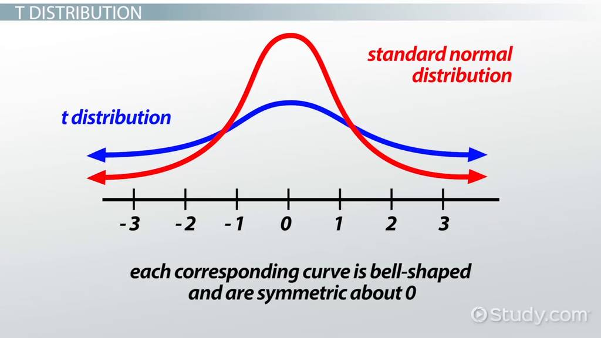
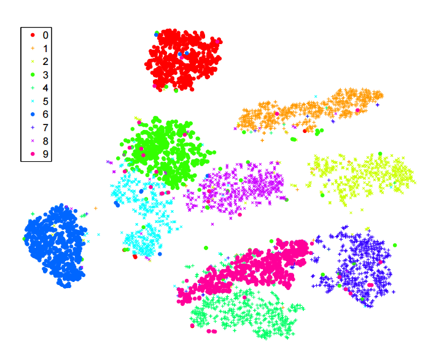

# t-SNE (t-Distributed Stochastic Neighbor Embedding)

- Tipo de aprendizado: Não-supervisionado
- Subcategoria: Redução de Dimensionalidade
- Autoria: L.J.P. van der Maaten e G. E. Hinton. **Visualizing High-Dimensional Data Using t-SNE**. Journal of Machine Learning Research, 2008.

## Descrição

### Onde é usado (tecnicamente)

Utilizado para mapear dados de N dimensões para 2 ou 3 dimensões. O use-case mais comum disso é fazer a visualização desses dados em um gráfico.

### Como é utilizado

O objetivo de algoritmos de redução de dimensionalidade é mapear dados multidimensionais para 2 ou 3 dimensões, de forma a preservar suas características. Normalmente, isso se traduz em preservar as distâncias entre pontos vizinhos.

O algoritmo SNE (Stochastic Neighbour Embedding) faz isso usando a medida inversa: isto é, a medida de similaridade entre os vizinhos. Essa similaridade, definida no intervalo [0,1] pode ser vista como uma probabilidade, por isso o "Estocástico" no nome.

Dessa forma, para um conjunto de dados em uma dada dimensão, temos uma distribuição de probabilidades. Define-se então uma função de custo como sendo a diferença entre a similaridade de duas distribuições: a primeira, calculada sobre os pontos com dimensão N, e a segunda, calculada sobre os pontos em dimensão 2.

Obtemos, então, um problema de otimização: mapear cada ponto (x1, x2, ..., xn) em um ponto (x1, x2) de forma a minimizar essa função custo. Esse tipo de problema é normalmente resolvido utilizando o algoritmo de gradiente descendente.

O "t" no nome do algoritmo vem do uso da distribuição T de Student, uma variação da distribuição normal com as caudas mais pesadas:

O uso dessa distribuição traz duas vantagens: evita aglomerações em torno da origem e sua derivada, usada no algoritmo de gradiente descendente, também é mais fácil e rápida de se calcular.

### Exemplos de caso de uso

Clusterização de dados não estruturados como imagens, vídeos, áudios, texto, etc.

A imagem a seguir mostra a visualização obtida através da aplicação desse algoritmo ao dataset do MNIST: um dataset de imagens de dígitos manuscritos. É possível perceber a formação de clusters diferentes para cada dígito.

## Referências

- [GitHub do pesquisador](https://lvdmaaten.github.io/tsne/)
- [Wikipedia](https://en.wikipedia.org/wiki/T-distributed_stochastic_neighbor_embedding)